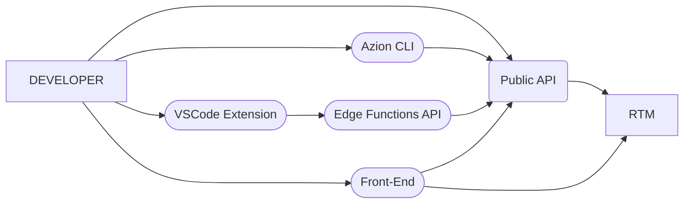
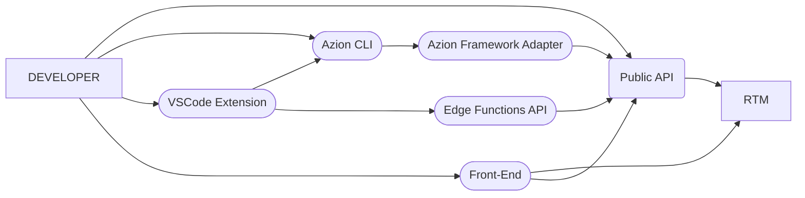
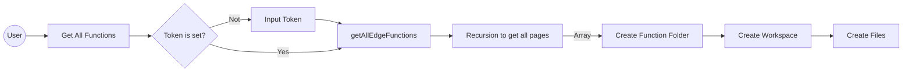
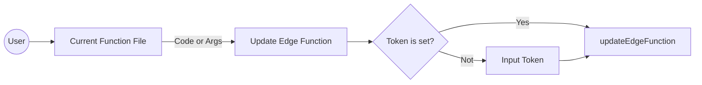

# Welcome to Azion Edge Functions Extension

**[This project](https://github.com/jotanarciso/azion-edge-functions-vscode-extension)** emerged from a personal project with the objective of bringing Azion closer to the developer. Currently we will only support managing Edge Functions, but in the future it may scale to other products.

  

## Example of RTM Interfaces

  

### Current:

  

### Flareact and Next.js support were implemented:

We will use the public API directly for Pure Edge Functions and add the CLI to run the Adapter on Edge Functions that needs to be compiled (Flareact or Next.js).

## Features

  

Table with the actions that the extension currently allows.

  

| | Pure Edge Function | Flareact | NextJS 
|-|-|-|-
|View |`yes` | `yes`|`not` | `not`
|Create |`not` |`yes`|`not` | `not`
|Update |`yes` |`not`|`not` | `not`
|Delete |`not` |`not`|`not` | `not`

  
  

## Workflow

  

### Get All Functions

  

### Update Functions

## Source

### helper.js

Helper functions used in projects.

  
  

**Create Progress** createProgress() < Promise >

Function responsible for *managing promises* and *controlling user feedback (requests and operations)* with `window.withProgress({})` VSCode interface.

  

Args

| | Title | Promise
|-|-|-
|Type|String| [Promise](https://developer.mozilla.org/en-US/docs/Web/JavaScript/Reference/Global_Objects/Promise) |
|Means|Title of the loading window| Promise to be managed and resolved

  

**Return**: Promise resolved or Rejected < Promise >.

##

  

**Create Folder** createFolder() < String >

Function responsible for creating folders in user files ([fs.mkdirSync](https://www.geeksforgeeks.org/node-js-fs-mkdirsync-method/)).

  

Args

| | Path
|-|- 
|Type|String| [Promise](https://developer.mozilla.org/en-US/docs/Web/JavaScript/Reference/Global_Objects/Promise) |
|Means|Title of the loading window| Promise to be managed and resolved

  

**Return**: Created Folder Path.

##

  

**Create File** createFile() < void >

Function responsible for creating files in user files ([fs.writeFileSync](https://www.geeksforgeeks.org/node-js-fs-writefilesync-method/)).

  

Args

| | Name | Content | Path | Extension
|-|-|-|-|-
|Type|String|[ArrayBufferView](https://nodejs.org/api/buffer.html)|String| String
|Means|Name of the file to be created| File content | Directory to create the file | File extension

  
  

**Return**: void

##

  

**Create Workspace** createWorkspace() < void >

Function to open folder in the user's current workspace ([VSCode Workspaces](https://code.visualstudio.com/api/extension-guides/virtual-workspaces)).

  

Args

| | Path | Name
|-|-|-
|Type|String|String|S
|Means|Folder path to opend| Workspace name

  

**Return**: void

##

  

##

  

**getFileExtension** getFileExtension() < string >

The function that receives the key returns the value of the `langs.js` object.

  

Args

| | langName
|-|-
|Type|String|String|S
|Means|language name to get extension: `foo('javascript') => 'js'`

  

**Return**: Extension

##

  

**slashUnicode** slashUnicode() < string >

Function used to convert slash to unicode and unicode to slash `(slash <-> unicode)`.

  

*Why: slashes are not allowed as a folder name.

Example: A/B Test*

  

Args

| | str | type = "unicode" or "string"
|-|-|-
|Type|String|String|S
|Means| The function, according to the arguments, convert slashes to unicode and also does the opposite process.

  

**Return**: String converted

  
  

### services.js

Provides verbs to make requests to Azion's Edge Functions public api.

  

**get** get() < Promise >

Verb to *get* Edge Functions data.

  

Args

| | TOKEN | URL
|-|-|-
|Type|String|String|S
|Means| Authentication token | URL to make request

  **Return**: User Edge Functions

##

**patch** patch() < Promise >

Verb to *patch* Edge Functions data.

  

Args

| | TOKEN | functionId | Payload
|-|-|-|-
|Type|String|Number|Object
|Means| Authentication token |ID of the Edge Function to be updated | Payload of the Edge Function to be updated.

  

**Return**: User Edge Function updated

##

### messages.js

KV to store the extension texts.

##

  

### extension.js

*Main file* that creates commands and receives user input.

  

##

  
  

## Some understandings

- Each Pure Edge Function is represented by a folder (named by the Edge Function).

- Each folder (Pure Edge Function) contains two files: *args.json with function args* and *(code.js || code.lua) Twith code.*

- We call here the Pure Edge Function the Functions that do not Flareact or Next.js.

  

## TODO

  

- Publish Extension By Azion (is [currently published](https://marketplace.visualstudio.com/items?itemName=jotanarciso.azion-edge-functions) by [jotanarciso](https://github.com/jotanarciso/))

- ~~Add Flareact Support **w/ CLI**~~

- Add Next.js Suport **w/ CLI**

- Add tests

- Add others actions (work with Edge Apps, Domains...)

  

## Run

$ yarn Install

Then open this folder in **VSCode**  **→**  *Run*  **→**  *Start Debugging* or *Start Without Debugging*

  

## Links

[Visual Studio Code API](https://code.visualstudio.com/api/references/vscode-api)

  

[Current Extension on Marketplace](https://marketplace.visualstudio.com/items?itemName=jotanarciso.azion-edge-functions)

  

[Demo](https://drive.google.com/file/d/1t6aA7zNFGUwIftBqFmpC4WzXlUOQ2gkR/view?usp=sharing)